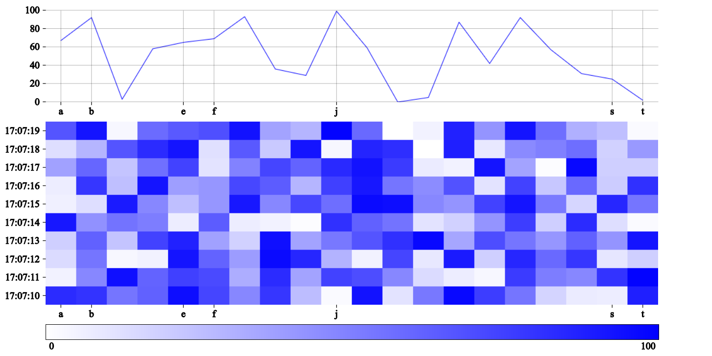

## About react-spectrogram
React component that visualizes the spectrum of frequencies of a signal that varies with time - Spectrogram.

Component is based on &lt;canvas&gt; tag. The shift operation was carefully chosen to maximize performance. It is implemented by .drawImage() method, that means the canvas is drawn onto itself with an offset. This effectively deletes anything that is shifted beyond canvas in a single operation. Experimental evaluation revealed this method to be much faster than using .putImageData() method [\[1\]](https://cse512-19s.github.io/FP-Signal-Viz/whitmire_paper.pdf). After that the new data are drawn as a row.



Another example of spectrogram visualizing Digital Audio Broadcasting signal [here](./resources/dabExample.png).

Feel free to share love at github by giving this project a star or creating a new issue if you have any problem or suggestion. Any feedback is valued.

## Usage

Spectrogram is written in Typescript. Check types yourself [here](./src/Spectrogram.types.ts).

View source code of the following code [here](./examples/RandomExample.tsx).

```TSX
import React from "react";
import { Spectrogram } from "react-spectrogram";

const RandomExample: React.FC = () => {
    ... // rest of component
    return (
        <Spectrogram
            data={{                 // data respresents only 'one row' in #heatmapChart
                x: ...              // type: Array<number | string | Date>
                y: ...              // type: Array<number>
                z: ...              // type: number | string | Date
            }}
            layout={{               // changing this property dynamically could lead to unwanted results
                width: 1000,        // width of canvas in pixels
                paddingTop: 40,
                paddingRight: 80,
                paddingBottom: 40,
                paddingLeft: 80,
                line: {
                    height: 150     // height of #lineChart canvas in pixels
                },
                heatmap: {
                    height: 300,    // height of #heatmapChart canvas in pixels
                    marginTop: 32   // X axis needs a little bit of space
                },
                scale: {            // scale is the block which stretches across the bottom
                    height: 24,
                    marginTop: 32
                }
            }}
            options={{              // changing this property dynamically could lead to unwanted results
                xAxis: {            // horizontal axis
                    displayAxis: true,
                    displayGrid: true,
                    values: [..., ..., ...],
                    // values: pass subset of data.x if you want to display just a subset of data.x values
                    // otherwise pass the same array as in data.x
                    color: "black"  // optional argument (default: "black")
                },
                yAxis: {            // vertical axis
                    displayAxis: true,
                    displayGrid: true,
                    values: [..., ..., ...],
                    // values: first element is the minimal value; last element is the maximal value
                    color: "black"  // optional argument (default: "black")
                },
                zAxis: {
                    displayAxis: true,
                    displayBins: 10,// 'how many rows in heatmap do you want?'
                    color: "black"  // optional argument (default: "black")
                },
                theme: "white-blue" // optional argument (default: "white-blue")
            }}
        />
    );
};

export default RandomExample;
```

## Limitations
* ❗ Argument *width* should be integer multiple of the length of the passed data *data.y* [\[2\]](https://html5rocks.com/en/tutorials/canvas/performance/#toc-avoid-float). The reason is that the size of one data point is determined by the division of the *width* of the canvas and the length of the *data.y* array. If the result of this division is floating point then the canvas is forced to use anti-aliasing filter to smooth out the lines and that means that the information coded in the color will be altered. The example of this behaviour can be observed [here](./resources/incorrectWidthExample.png) (background color is seeping through). 
* Properties *layout* and *options* should be constants. Otherwise it could lead to some unwanted results. The only property that should change is *data* property.
* *heatmap.height* property should be integer multiple of the number of *displayBins*. (Basically same reason as above but not as critical)
* no interactions nor animations

## Installation
```sh
npm install --save react-spectrogram
```

## License
This project is made available under the MIT License.

## References
\[1\] &nbsp; &nbsp; WHITMIRE, E. *High-performance Web-based Visualizations for Streaming Data*. Spring 2019, University of Washington. Available at: https://cse512-19s.github.io/FP-Signal-Viz/whitmire_paper.pdf

\[2\] &nbsp; &nbsp; SMUS, B. *Improving HTML5 Canvas Performance*. August 2011, Available at: https://html5rocks.com/en/tutorials/canvas/performance/#toc-avoid-float

